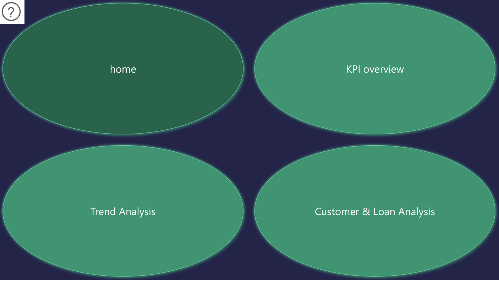
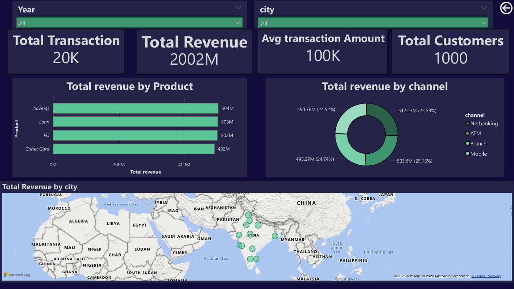
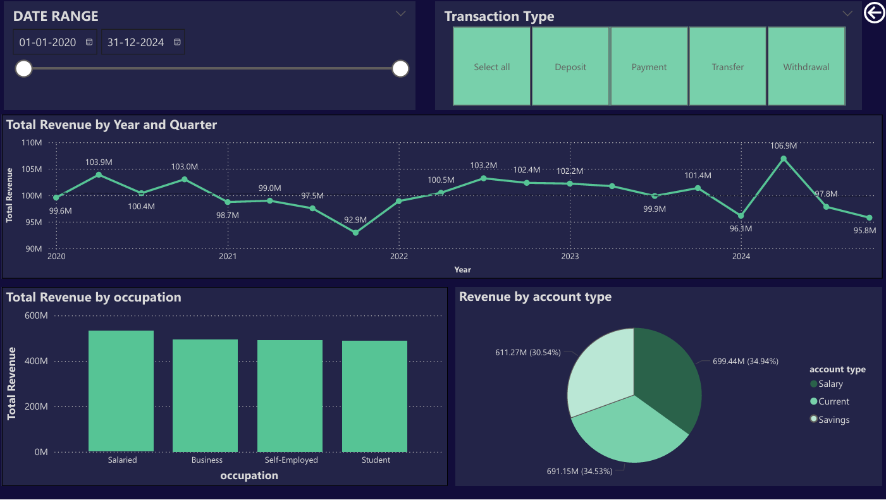
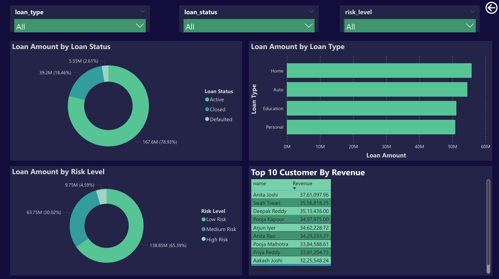

# 🏦 Bank Customer Analytics Dashboard

An end-to-end data analytics project built using **PostgreSQL** and **Power BI**, analyzing customer behavior, transaction trends, and loan risk across a simulated banking dataset of 21,500+ records.

---

## 📊 Dashboard Preview

### Home Page


### KPI Overview


### Trend Analysis


### Customer & Loan Analysis


---

## 🛠️ Tools & Technologies

| Tool | Usage |
|---|---|
| PostgreSQL (pgAdmin) | Database, data modeling, querying |
| Power BI Desktop | Dashboard, DAX measures, visualization |
| Python (Pandas, NumPy) | Dataset generation |

---

## 📁 Project Structure

```
bank-analytics-project/
├── data/
│   ├── customers.csv
│   ├── transactions.csv
│   └── loans.csv
├── sql/
│   ├── create_tables.sql
│   └── analysis_queries.sql
├── powerbi/
│   └── bank_analytics.pbix
├── screenshots/
│   ├── home.png
│   ├── kpi_overview.png
│   ├── trend_analysis.png
│   └── customer_loan.png
└── README.md
```

---

## 🗄️ Database Schema

Three tables connected via star schema:

- **customers** — 1,000 rows | customer demographics and account info
- **transactions** — 20,000 rows | all banking transactions from 2020–2024
- **loans** — 500 rows | loan details, EMI, and repayment status

---

## 🔍 SQL Analysis

12 queries written covering:

- KPI Overview (total revenue, transactions, average transaction amount)
- Monthly revenue trend using `DATE_TRUNC` and window functions
- Revenue breakdown by product, channel, city, occupation, and account type
- Loan analysis by type and status
- Loan default risk segmentation using `CASE WHEN`
- Month-over-Month growth using `LAG()` window function
- Top 10 customers by revenue using `JOIN` + `LIMIT`
- RFM customer segmentation (Recency, Frequency, Monetary) using CTEs

---

## 📈 Dashboard Pages

### 1. Home
- Navigation page with buttons linking to all 3 dashboard pages

### 2. KPI Overview
- Total Transactions, Total Revenue, Avg Transaction Amount, Total Customers
- Revenue by Product (bar chart)
- Revenue by Channel (donut chart)
- Revenue by City (map)
- Slicers: Year, City

### 3. Trend Analysis
- Monthly revenue trend with drill-down (Year → Quarter → Month)
- Revenue by Occupation (column chart)
- Revenue by Account Type (pie chart)
- Slicers: Date Range, Transaction Type

### 4. Customer & Loan Analysis
- Loan Amount by Status (donut)
- Loan Amount by Type (bar chart)
- Loan Risk Level distribution (donut)
- Top 10 Customers by Revenue (table)
- Slicers: Loan Type, Loan Status, Risk Level

---

## 💡 Key Insights

- **Savings** is the highest revenue-generating product at ₹504M
- Revenue is evenly distributed across all channels (Mobile, ATM, Branch, Netbanking) at ~25% each
- **65%** of loan customers are Low Risk, while only **4.6%** are High Risk
- **Home loans** account for the highest loan disbursement amount
- **Salaried** customers generate the most revenue across all occupations
- Top customer (Anita Joshi) generated ₹37.6L in transaction revenue

---

## ⚙️ How to Run

1. Clone this repository
   ```
   git clone https://github.com/sambhavsharma0488/bank-analytics-project.git
   ```
2. Import CSVs into PostgreSQL using the `create_tables.sql` script
3. Run `analysis_queries.sql` to verify data
4. Open `bank_analytics.pbix` in Power BI Desktop
5. Update the PostgreSQL connection to your local credentials

---

## 👤 Author

**Sambhav Sharma**  
[GitHub](https://github.com/sambhavsharma0488)
